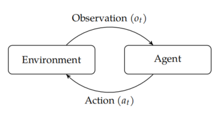

## foucus on $o_t$ and $a_t$, 聚焦于以下四种不确定性

### outcome uncertainty
### model uncertainty
### state uncertainty
### interaction uncertainty
## methods
### explicit programming: simple problems
### supervised learning: behavioral cloning, actually knows the best course of action for a representative collection of situations
### optimization: specify the space of possible decision strategies and a performance measure to be maximized
### planning: a form of optimization
### reinforcement learning: relaxes the assumption in planning, learn about the environment, identify the characteristics
## five parts
### outcome uncertainty: single point decision
### outcome uncertainty: sequential problems
- `MDP`: Markov decision process
### model uncertainty: learn model
- the dynamics and rewards not known exactly
- challenges
    - 平衡环境的探索和经验中获取的知识
    - rewards可能在decision之后很久才会出现
    - 必须从有限的经验中概括
### state uncertainty: imperfect perceptual information
- `POMDP`: partially observable Markov decision process
- given a past sequence observation and action, update belief distribution
### interaction uncertainty: multiple agents
- `POMG`: partially observable Markov game
- shared reward among agents