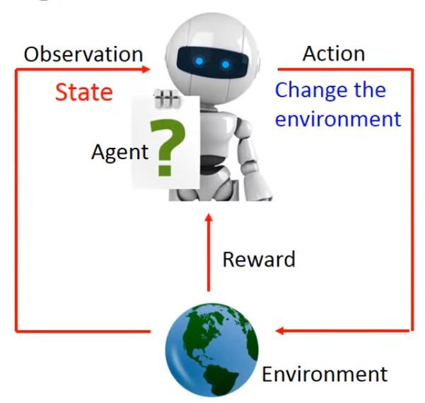
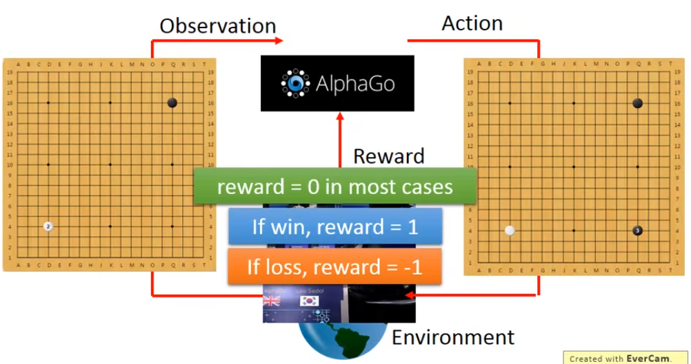
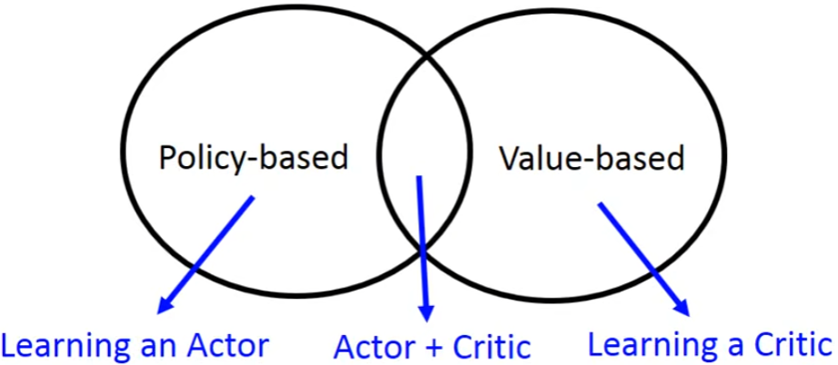
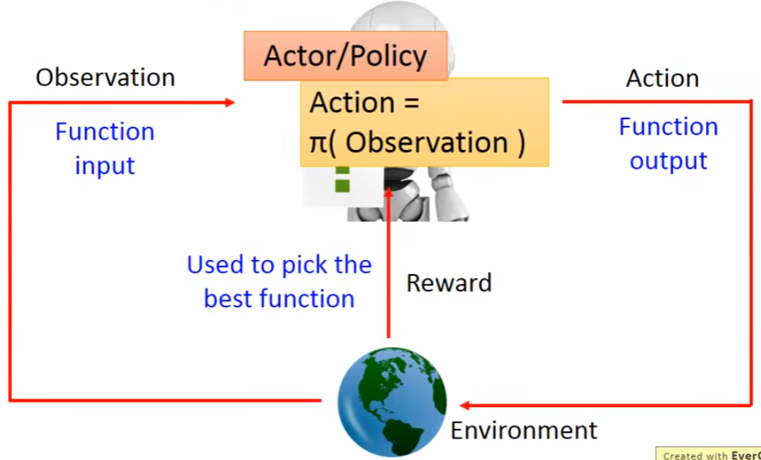
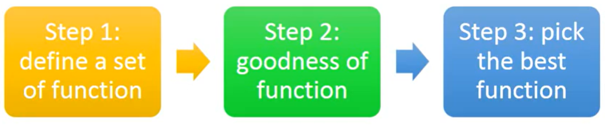

- 问题抽象
  - 
  - 
  - 只有少数action得到reward ，去挖掘正确的action，是个困难的难题
- supervised vs reinforcement
  - 下围棋举例，人类样本也不是最优的，learning from `teacher`
  - 从过去经验里面学， learning from `experience`，需要大量的example，alphago(3千万)，机器对弈机器
  - chatbot示例，怎么判断reward好不好，需要人定，会不会用GAN网络
  - 打电玩
- difficulties of reinforcement learning
  -  reward delay
     -  space invader游戏，射击会得到比较高的reward，不过左右移动也会影响到后续的射击
  -  agents actions affect the subsequent data it receives
     -  agent行为会影响到接下来的数据，agent要学会探索没有做过的行为
-  outline
   -  先不讲MDP、DQN，直接讲目前最流行的`A3C`(Asynchronous Advantage Actor-Critic)
   -  
-  Policy_based(learning an actor)
   -  
   -  
   -  step1: neural network as actor vs lookup table
      -  从电玩的角度，lookup table是无法穷举的
      -  NN，就算没见过，也能得到一个不错的结果，generalized
   -  step2: goodness of function, $\overline{R}_\theta$衡量actor的好坏，$\theta$为参数
      -  total reward的表示：$R_\theta=\sum_{t=1}^{T}r_t$
      -  由于actor及观测值的随机性，需要衡量R的期望值$\overline{R}_\theta$
      -  期望值是怎么计算的呢
         -  an episode: $\tau=\lbrace s_1,a_1,r_1,s_2,a_2,r_2,...,s_T,a_T,r_T \rbrace$
         -  $R_{\tau}=\sum_{n=1}^{N}r_n$
         -  由于存在随机性，$\tau$这个过程存在的几率为$P(\tau|\theta)$
         -  则$\overline{R}_\theta=\sum_{\tau}R(\tau)P(\tau|\theta)\approx\frac{1}{N}\sum_{n=1}^NR(\tau^n)$
            -  $obtain \lbrace \tau^1,\tau^2,...,\tau^N \rbrace, sampling \tau from P(\tau|\theta) N times$
         -  
   -  step3: pick the best function, gradient ascent
      -  problem statement: $\theta^\ast=arg\underset{\theta}{max}\overline{R}_\theta$ $\overline{R}_\theta=\underset{\tau}{\sum}R(\tau)P(\tau|\theta)$
   -  里面提到了两个问题
      -  为什么用log，除以概率P
      -  如果reward都是正，怎么办