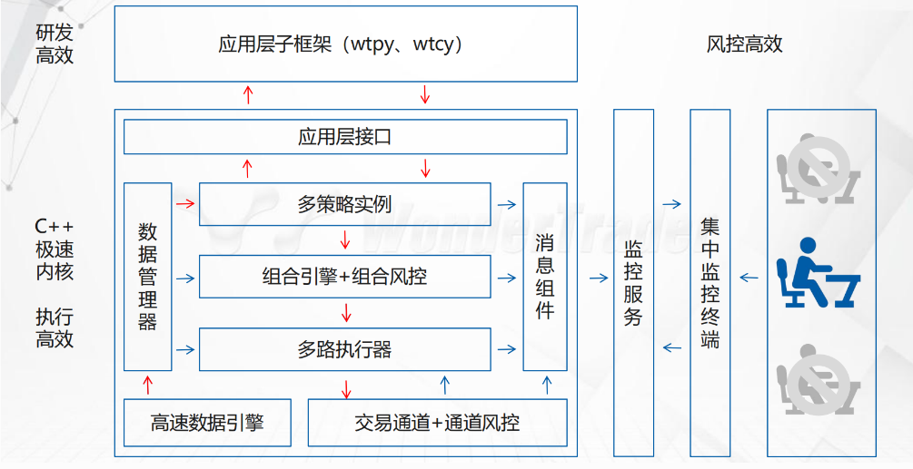
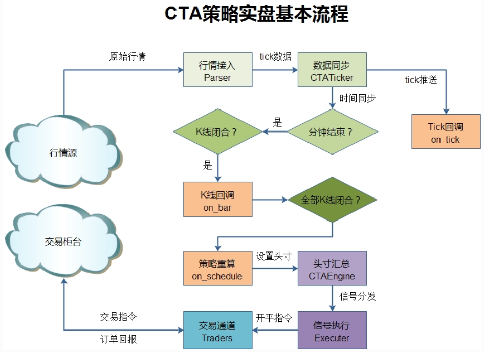
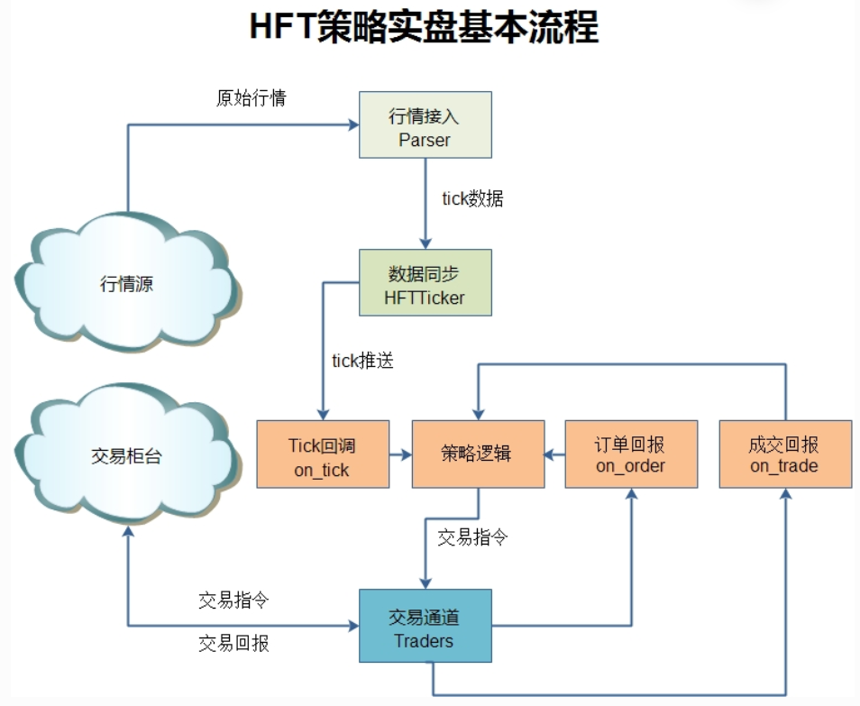
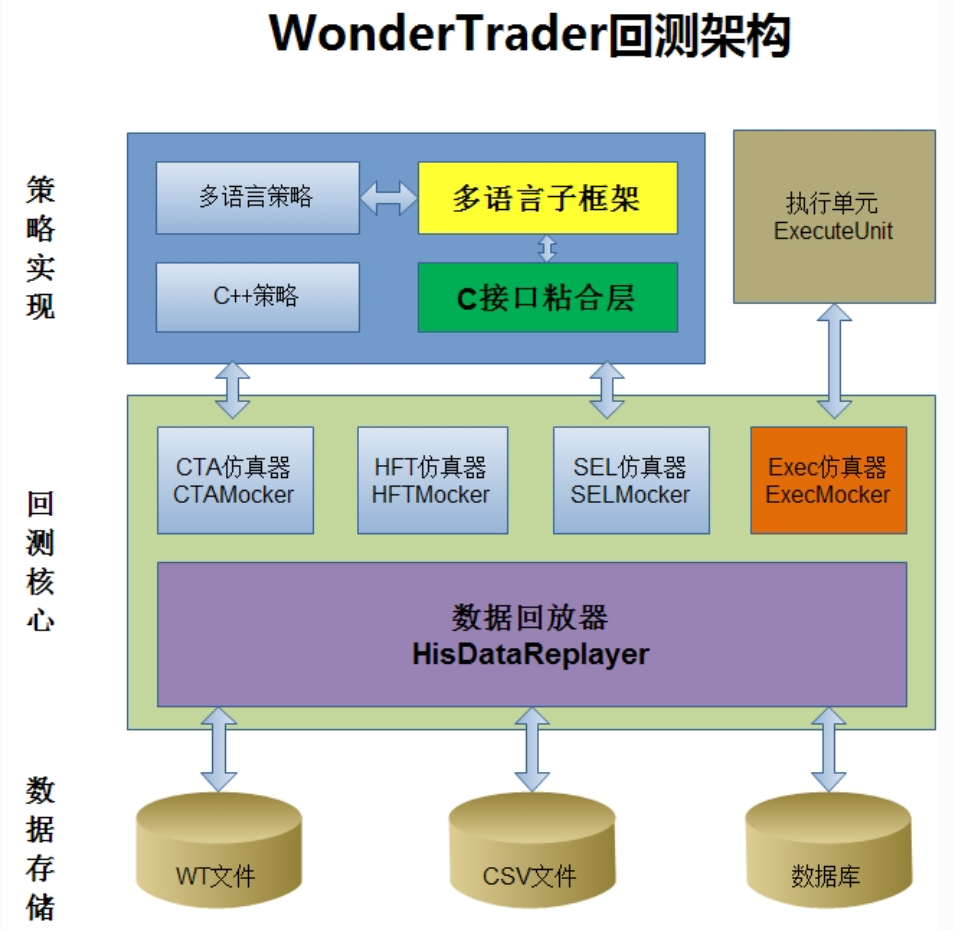

### 几大部分
#### `WtStudio`: 刚接触量化，或者IT技能相对薄弱
#### `wtpy`: 有一定的IT技能，对于交易机运维有一定的基础；有很丰富的IT技能，编程能力也很强，但是策略对滑点不敏感，主要模块
#### `wtcpp`：策略对延迟很敏感，`UFTEngine`
### 阅读顺序
#### WonderTrader简介
- 研发、交易、到运营、调度

- 交易引擎
  - `CTA引擎`：标的少，计算逻辑快，事件+时间驱动，70us（单标的择时、中频以下的套利）
  - `SEL引擎`：标的较多，计算耗时长，时间驱动（多因子选股策略、截面多空策略）
  - `HFT引擎`：高频策略引擎，高频或者低延时策略，事件驱动，1-2us
  - `UFT引擎`：极速策略引擎，针对超高频或者超低延时策略，事件驱动，200ns
- 全类型回测

- WonderTrader有一个独立的执行器入口模块`WtExecMon`，用户可以实现自己的`WtExecFact`来添加算法执行单元
#### 基础用法
- [基础用法]("basicusage.md")
#### 实用工具
#### 控制台
#### 其他