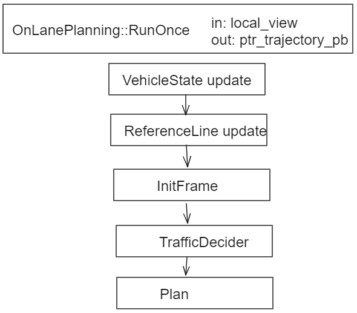

### 执行流程

### VehicleState Update
- 由`VehicleStateProvider`提供
- 由`localization`提供`x/y/z/timestamp/roll/pitch/yaw/heading/angular_velocity/linear_acceleration/pose`
- 由`chassis`提供`linear_velocity/gear/driving_mode/steering_percentage`
- `kappa`由角速度除以线速度
### ReferenceLine Update
- 由`ReferenceLineProvider`提供
- 判断`routing sequenceno`
- 调用`UpdatedReferenceLine`，在独立线程中执行
- 轨迹拼接`ComputeStitchingTrajectory`，确认是否要重新规划
### InitFrame
- 包含一次规划所需要的所有信息
  - sequence_num_
  - local_view_
  - planning_start_point_
  - vehicle_state_
  - reference_line_provider_
- CreateReferenceLineInfo
### TrafficDecider
- 目的是设置reference_line drivable
- 交通法规是否支持
- 判断红绿灯等，加停止墙之类
- `reference_line::path_decision`
### Plan
- `public_road_planner`进入`scenario`流程