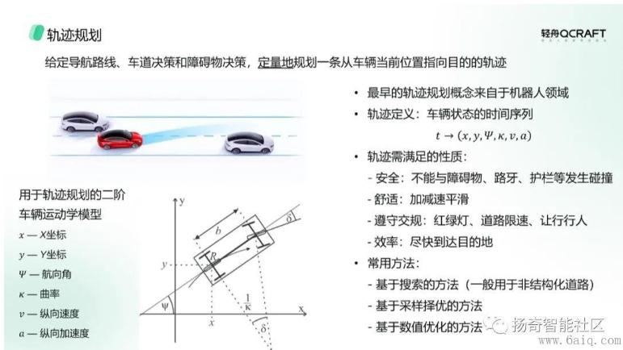

- [轻舟智航：自动驾驶中的决策规划技术](https://www.6aiq.com/article/1657865296348)
    - 导航模块，A*
    - 决策，两级决策
        - 车道级决策
            - 有限状态机，状态转移
            - 轨迹评价的变道决策算法
        - 障碍物决策
            - 基于规则，适用于单障碍物简单场景
            - 基于搜索的算法，如A*、DP等，适用于多障碍物复杂场景
        - 车道决策和障碍物决策后，可以共同为下游的轨迹规划提供一个可行解空间，做进一步的轨迹优化
    - 轨迹规划
        