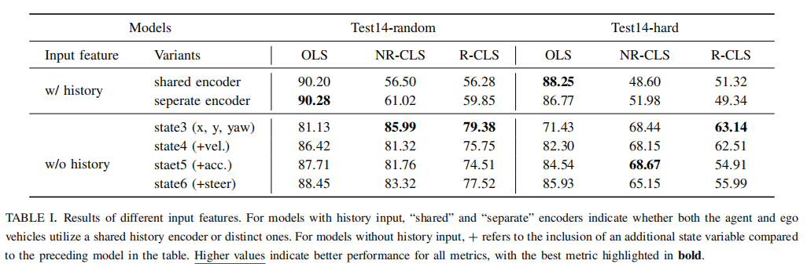
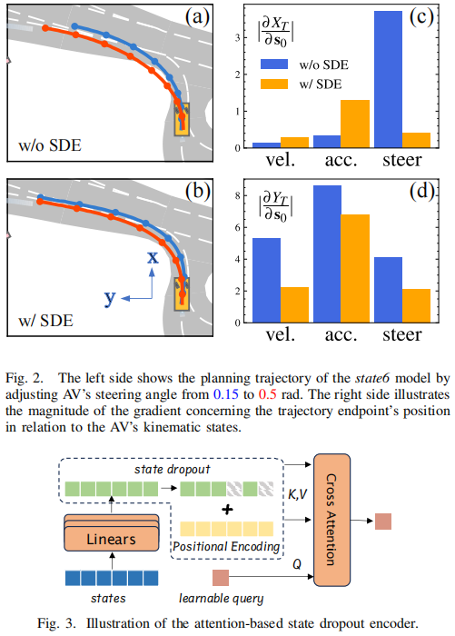
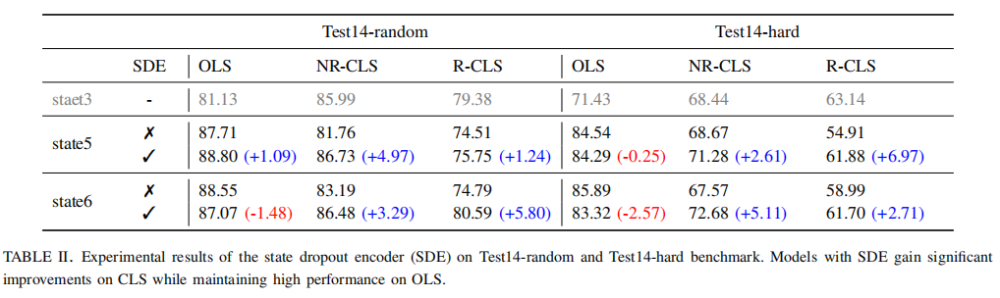

- the essential features for ego planning
  - AV current pose: `position` and `heading`
  - history is not necessary
  - 
  - SDE: state dropout encoder，用来解决对运动学属性的依赖问题
    - 
    - 经过SDE的闭环性能大幅提升，且开环性能相比没有动力学的state3模型也有提升
- the effective data augmentation techniques to reduce `compounding errors`
  - history perturbation
  - state perturbation
  - future correction
  -  the indispensability of proper normalization for the effectiveness of augmentation
- an imitation gap that has been `overlooked`
- a strong baseline model `PlanTF`