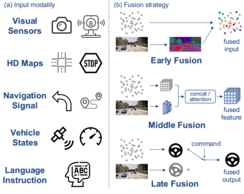
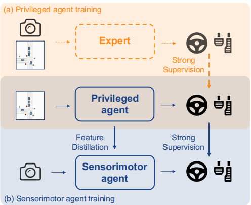
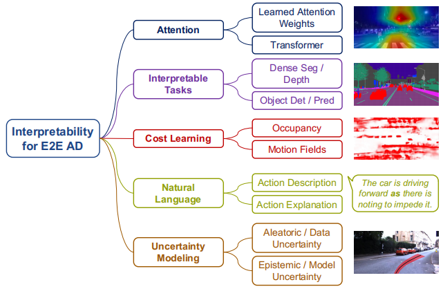
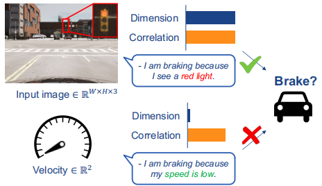

- 
-  可以接着时间轴扩展
- methods
  - 
  - policy指啥
  - Imitation Learning
    - 描述 输出 waypoints 与 control信号的优缺点
    - 需要描述这三点方法论上的区别
    - BC: simple & efficiency
      - state independently, 导致 covariate shift，为这个问题，加入**DAgger**
      - causal confusion，学习的虚假相关性
    - Inverse Optimal Control: 为啥要学reward，从李宏毅的视频里面找答案
      - 增强了安全和可解释性
    - RL：reward design
      - 什么是critic，也叫做Q network
      - 预测具有最高回报的action
      - RL需要比IL多的多的数据来训练，同时也需要一个环境来收集诸如可能导致危险的数据
        - 在自动驾驶领域，强化学习相较于模仿学习需要更多的数据，原因在于强化学习依赖于通过与环境的交互来学习最优策略，这一过程往往需要大量的尝试和错误，从而积累经验。模仿学习则是通过模仿人类驾驶员的行为来进行学习，已经有了一定的行为模式作为参考，因此在数据需求上相对较少
        - 强化学习在自动驾驶中的应用通常需要世界模型来进行仿真，原因在于自动驾驶的决策过程需要考虑多种复杂因素，如交通规则、车辆动态、行人行为等，这些因素在现实世界中具有高度的不确定性和随机性。
      - **DQN**
- benchmarking
  - smart agent是不是可以直接用来做决策
    - 不可以，是基于规则，或者是基于样本训练而来，有明确的规则
  - real-world evaluation
    - DARPA
    - MCity
    - costly and risky
  - **online/closed-loop simulation**
    - 仿真的结果不一定适用于现实场景
    - 讨论以下四个部分
      - parameter initialization: 仿真巨大的参数量
        - 程序生成 Procedural Generation
          - rules, heuristics, and randomization
          - efficiency
          - needs pre-defined parameters and algorithms to control generation reliability, time-consuming
        - 数据驱动 Data-Driven
          - learn the required parameters, the simplest way is to sample from real-world driving logs
          - its ability to capture the natural variability present in real-world data, leading to more realistic simulation scenarios
          - it may not encompass rare situations that are critical for testing the robustness of autonomous driving systems
          - generative modeling
      - traffic simulation
        - rule based
          - IDM, predefined rules, a car-following model
          -  inadequate to simulate realistic motion and complex interactions
        - Data-Driven
          -  inadequate to simulate realistic motion and complex interactions
          -  capture more nuanced, realistic behavior
      - Sensor Simulation
        - 对端到端来说至关重要，还需要包含传感器的noise and occlusions
        - Graphics-Based
          - 3D渲染
          - heavy computation, parallelization non-trivial
        - Data-Driven:
          - NeRF、3D Gaussian Splatting
          - high rendering times
          - domain adaptation GAN
      - Vehicle Dynamics Simulation
        - unicycle model or the bicycle model
        - CARLA adopts a multi-body system approach
    - Benchmarks
      - CARLA
      - nuPlan
  - offline/open-loop evaluation
    - 举例一个merge场景，如果没有相关的轨迹，早一点merge和晚一点merge可能被惩罚到
    - more comprehensive aspects such as traffic violations, progress, and driving comfort
    - open-loop results do not provide conclusive evidence of improved driving behavior in closed loop, due to the aforementioned drawbacks
- challenges
  - input modality
    - 
    - emerging sensors: mmwave radars, event cameras
    - End-to-end driving also requires identifying policy-related contexts and discarding irrelevant details
    - language as input: 方案参照具身智能，不过目前智能在云端使用
  - visual abstraction
    - it is helpful to design "good" intermediate perception representations
    - 表征设计
      - CNN or transformer
      - 感知表征如何设计供决策使用
      - HDMap是否需要在端到端中使用
    - 表征学习
      - 在大量无标签数据中进行自监督学习，比较有前景
  - world model
    - 世界模型提供明确的未来预测，包含动力学和奖励函数
    - 世界模型可以解决CARLA性能慢的问题
    - 不过，确认什么值得建模，怎么有效的对世界建模也是个挑战
  - multi-task learning
    - predict sparse signal
    - 构建多种类型对齐且高质量标注的大规模数据集依然是个挑战
  - policy distillation
    - "Teacher-Student" paradigm
    - teachers are not perfect drivers
    - student cannot learn policy
    - 
  - interpretability
    - 
    - attention visualization: attention maps
    - interpretable tasks: 将潜在特征解码为分割、目标估计等，但这些不能明确表明对决策的影响
    - cost learning: probabilistic occupancy and temporal motion fields, emergent occupancy, and freespace用于采样轨迹
    - natural language: jointly estimate action, narration, and reasoning，可以描述下理想和Wayve的方案
    - uncertainty modeling:aleatoric uncertainty 随机不确定性 and epistemic uncertainty 认知不确定性，需要想办法对这俩不确定性进行建模
  - safety guarantee
    - 需要后处理约束、safety check
  - causal confusion
    - copycat problem, access to more information leads to worse performance
    - 
    - dropout、keyframe增强、adversarial model
  - robustness / generalization
    - long-tailed distribution
      - 仿真、测试框架
    - covariate shift
      - BC的一大挑战就是covariate shift，只学到了形，在出现与专家轨迹不一致，或者其他agent行为与训练环境不一致的情况下，行为就不可控
      - DAgger应用于解决这个问题，但需要专家实时查询
    - domain adaptation,领域学习
      - sim to real
      - NeRF
- future trends
  - zero/few-shot learning
    - 模型应对训练数据外的场景处理
  - modular end-to-end planning
    - 模型的可解释性分析
  - data engine
    - 其实是对云平台的要求，数据提取、数据生成、自动化标注
  - foundation model
    - LLM强调的是拟人，而端到端模型需要精确的度量，所以LLM可以用于世界模型
- NERF
  - https://zhuanlan.zhihu.com/p/682966815
- Gaussian Splatting
  - https://zhuanlan.zhihu.com/p/672807108
- Wayve
  - LINGO可以增强人类对智能驾驶系统的信任，增强模型的可解释性
  - GAIA作为仿真的重要一环，用于生成式世界模型
  - Wayve的端到端模式，会推动后续的舱驾一体