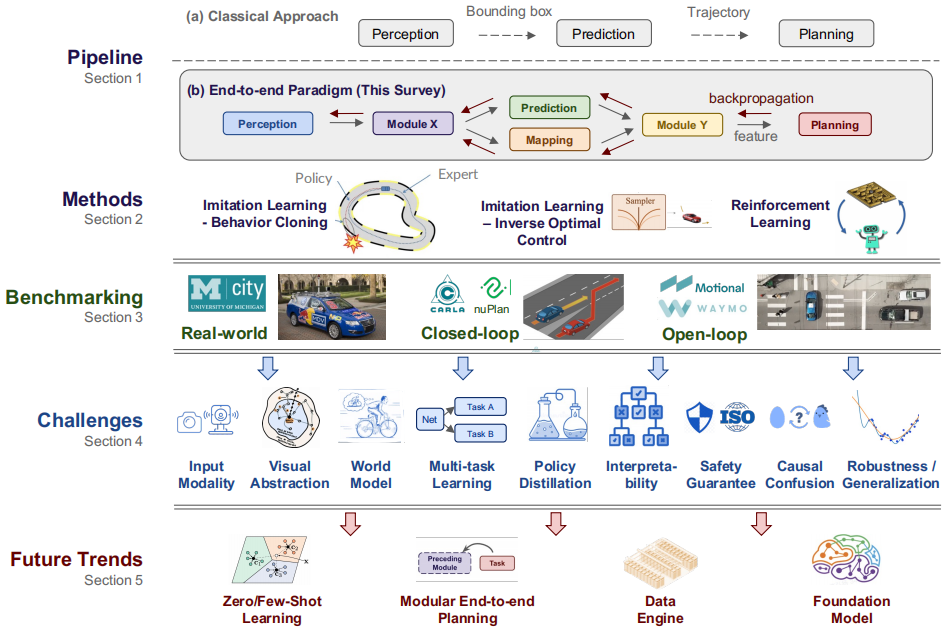
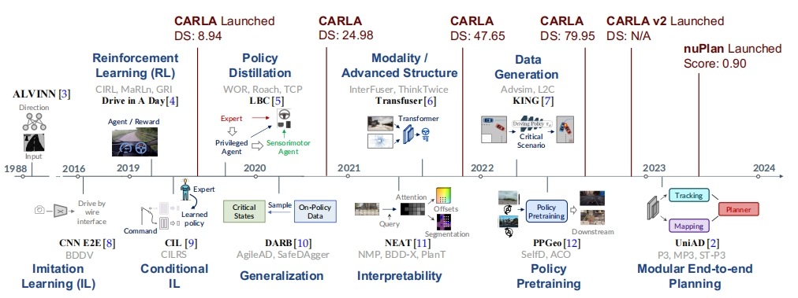
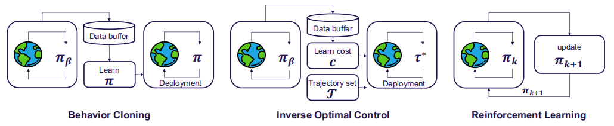

- 
-  可以接着时间轴扩展
- methods
  - 
  - policy指啥
  - Imitation Learning
    - 描述 输出 waypoints 与 control信号的优缺点
    - 需要描述这三点方法论上的区别
    - BC: simple & efficiency
      - state independently, 导致 covariate shift，为这个问题，加入**DAgger**
      - causal confusion，学习的虚假相关性
    - Inverse Optimal Control: 为啥要学reward，从李宏毅的视频里面找答案
      - 增强了安全和可解释性
    - RL：reward design
      - 什么是critic，也叫做Q network
      - 预测具有最高回报的action
      - RL需要比IL多的多的数据来训练，同时也需要一个环境来收集诸如可能导致危险的数据
        - 在自动驾驶领域，强化学习相较于模仿学习需要更多的数据，原因在于强化学习依赖于通过与环境的交互来学习最优策略，这一过程往往需要大量的尝试和错误，从而积累经验。模仿学习则是通过模仿人类驾驶员的行为来进行学习，已经有了一定的行为模式作为参考，因此在数据需求上相对较少
        - 强化学习在自动驾驶中的应用通常需要世界模型来进行仿真，原因在于自动驾驶的决策过程需要考虑多种复杂因素，如交通规则、车辆动态、行人行为等，这些因素在现实世界中具有高度的不确定性和随机性。
      - **DQN**
- benchmarking
  - smart agent是不是可以直接用来做决策
  - real-world evaluation
  - **online/closed-loop simulation**
  - offline/open-loop evaluation
- challenges